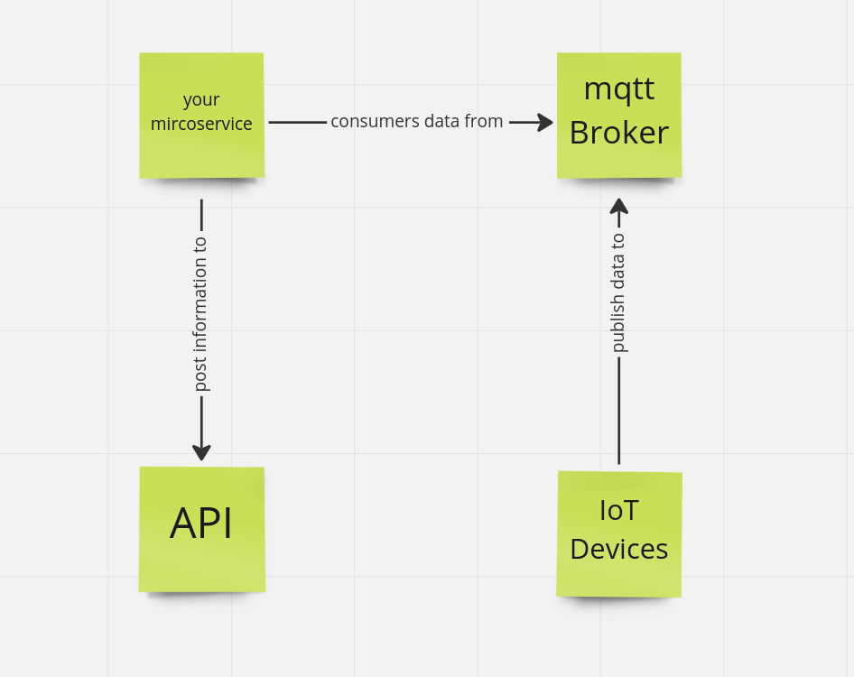

# Assignment: Backend 

This assignment intends to assess back-end developer skills that you would use at work. To complete this assignment, you should follow the below requirements: 

# Requirements: 

* **README**: Include a file, for example, a README.md that explains how start the application, and any other information you deem relevant. You can also include an assumptions made.

* **Git Repository**: The source must be tracked by a GIT repository, and they bundle it following the submission instruction's part to be evaluated by our recruitment team. 

* **Programming Language**: NodeJS (JS/Typescript) or Python is preferred

* Implement the microservice outlined below in the **scenario overview**. Feel free to use any technology you think it appropriate to complete the requirements listed in the scenario.

* **(Optional) Improvement List**: Include a small list of improvements that could be made to the application.

* **(Optional) Docker**: The Application should be dockerized and added to the docker-compose file to communicate with the other applications.

## Scenario Overview:  


Your task is to create a microservice that connects with mqtt, consume a set of IOT device's data from mqtt, and send frequency information and alerts to an api.



Under normal operation, the devices will publish their frequency & status data, sometimes that will post lower frequency data, sometimes they will post error states.
 
 
### You should implement the following in your microservice: 

1. **Every second** -> Post to /frequency api endpoint with a sliding 1 minute average of the frequency data for each device with the number of samples. (average of current time - 60s) 

1. **60 second average frequency is below 49** -> Post to /alerts api endpoint with status “low_freq”, if the device frequency recovers above 49, post to the /alerts endpoint with status “ok”. This should be done for each device

1. **Error status** -> Post to /alerts api endpoint with status “error”, if the device recovers post to the /alerts endpoint with status “ok”.  This should be done for each device

1. **(Optional) On Microservice Restart** -> It should try to use any previously known data to populate the 1-minute sliding window (some type of persistence)
 

### Api Details: 

Api will expose the following endpoints: 

**endpoint**: `/frequency`

sample post request:
```json
[
    {
        "frequency": 49.56,
        "samples": 60,
        "deviceId": "device1"
    }
]
```

**endpoint**: `/alerts`

sample post request:
```json
[
    {
        "status": "ok",
        "deviceId": "device4"
    },
        {
        "status": "low_freq",
        "deviceId": "device2"
    },
        {
        "status": "error",
        "deviceId": "device5"
    }
]
```

The Api will just log out the body of the request and return a 201 response code


# Mqtt devices detail
These are python scripts that publish data on mqtt. Please see `Running Locally` below for information on how to re-create certain states

### Topics & Payloads: 
- `/dummylink/{deviceId}/data/status`

example payload: OK

- `/dummylink/{deviceId}/data/frequency`

example payload: 49.81208523992623


# Additional Resources: 


* https://aws.amazon.com/what-is/mqtt/ - aws documentation on the basics of mqtt
* https://docs.docker.com/get-docker/ - you will need docker installed 
* https://docs.docker.com/compose/install/ - you will need docker-compose installed 

* You may need to install the `make` command on your operating system https://www.gnu.org/software/make/  


# Running Locally: 

There are four components in this development environment: 

* MQTT Broker: mqtt://0.0.0.0:1883 [your application needs to connect here to subscribe to device messages] 

* MQTT Probe: http://0.0.0.0:8888 [you can inspect the device’s messages] 

* Device [1-5]: you can use Makefile targets to control each one (see steps below) 

* Frequency API: http://0.0.0.0:3000 this accepts post request to the endpoints described earlier.

Please ensure that you have Docker, Docker Compose, and Make installed on your environment. 

1. **setup with:** `make setup`

2. **start the API, Broker and Probe with:** `make backend-up`

3. **open your browser and navigate to:** http://0.0.0.0:8888/ . You can see an entry for each device, but no events being captured. 

4. **start a device with:** `make device=1 device-up` (alternatively, you can start all 5 devices by omitting the device argument). 

5. **check the device status with:** `make device=1 get-state` (you must specify a device). You should receive the default behaviour: 0,NOISY. There are four possible states: 

    * `0,NOISY` – this is the default state, the device can post regular readings, low frequency readings, and faults. 

    * `1,REGULAR` – in this state, the device will publish frequency readings in a range between 49Hz to 50Hz and a status OK. 

    * `2,LOW` – in this state, the device will publish frequency readings in a range between 38Hz to 42Hz and a status OK. 

    * `3,FAULTY` – in this state, the device will publish frequency reading equal to –1Hz and a status ERROR. 

6. **you can change the state of a device with:** `make device=1 state=1 set-state`. The s argument should be the numerical value of the list above. If you supply and invalid value the device will default to 0,NOISY. You can verify the change by following Step 4. 

7. **you can simulate an outage by stopping a device with:** `make device=1 device-down` (alternatively, you can start all 5 devices by omitting the device argument). 


**Attention:**  DO NOT screen scrape the MQTT Probe, subscribe to the MQTT Broker. The probe is a testing tool put in place to facilitate your development process. We will not consider any code that leverages it. 


# Assessment: 

Your submission will be reviewed on the following points: 

* Your ability to follow the requirements 
* Implementation of the requirements 
* Code readability and maintainability 
* Test quality and coverage 
* We expect you to submit production quality code with all that this means to you. 

The assignment should be completed within 7 days and will start from the moment of the email reception with the associated documentation. Please inform us with due consideration if you require more time to complete. 

 

# Submission Instructions: 

To submit your coding challenge, commit all your changes to the master branch and run the following command: 

* `git bundle create coding-challenge.bundle HEAD master`

Email your coding-challenge.bundle file as an attachment to the person that originally sent you this coding challenge. We do our best to review and respond to submissions within 5 business days. 

Best of luck, and thanks for taking the time to do this coding challenge.